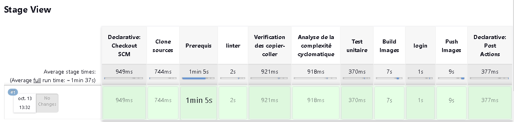

# TP3-Mise-en-place-pour-une-application-python-d-une-chaine-CI

### Objectif

Le TP consiste à mettre en oeuvre une chaîne d'intégration continue pour les applications python.


### Prérequis

 - un compte Github
 - un compte docker hub
 - Lance le script sur linux et avoir docker installer dessus


### Composition du dépot

Le dossier est constitué des dossiers et fichiers comme suit:

```
├── app
├── jenkins
│       ├── plugins.txt
├── docker-compose.yml
├── Jenkinsfile
├── README.md
```
### Configuration de jnekins

### Présentation du pipeline

Les étapes du pipeline sont décritées dans le Jenkinsfile qui est disponible sur le dépôt, jenkins l'utilise pour executer les tâches suivantes:

1. Clone le code source
2. Installe les paquets nécéssaire au lancement des tests
3. Lance le linter pylint
4. Verification des copiers-coller avec radon raw
5. Analyse de la Complexité Cyclomatique avec radon cc 
6. Lancement des tests unitaires
7. Builder l'image docker avec docker
8. Connexion sur docker hub
9. Pusher l'image sur le docker hub
10. Déconnexion de docker hub

